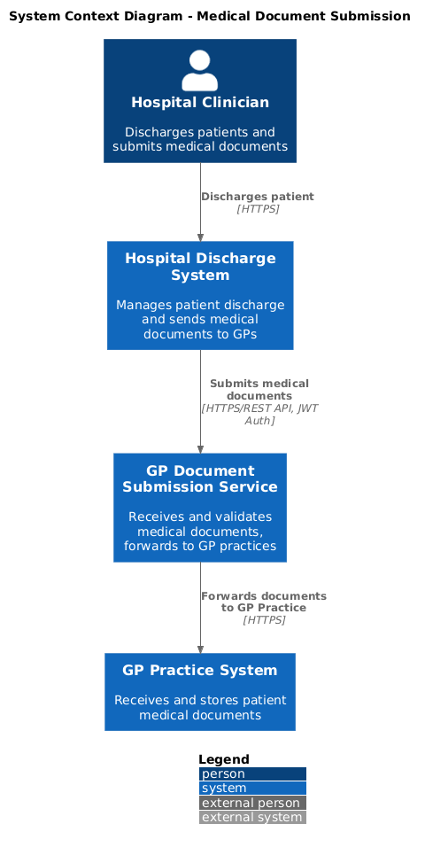
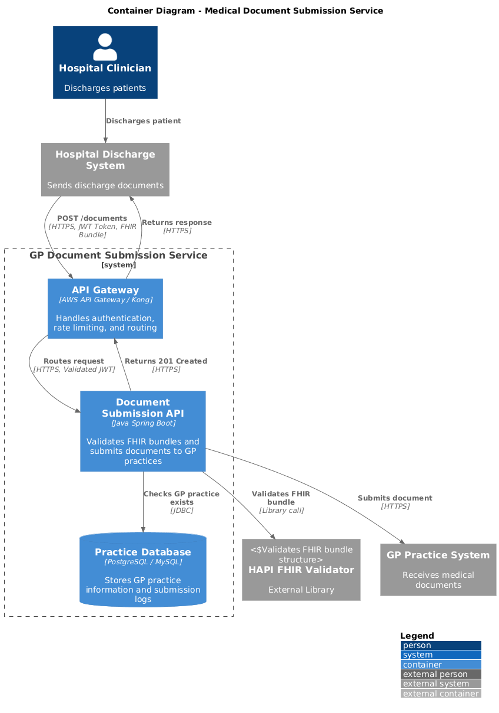
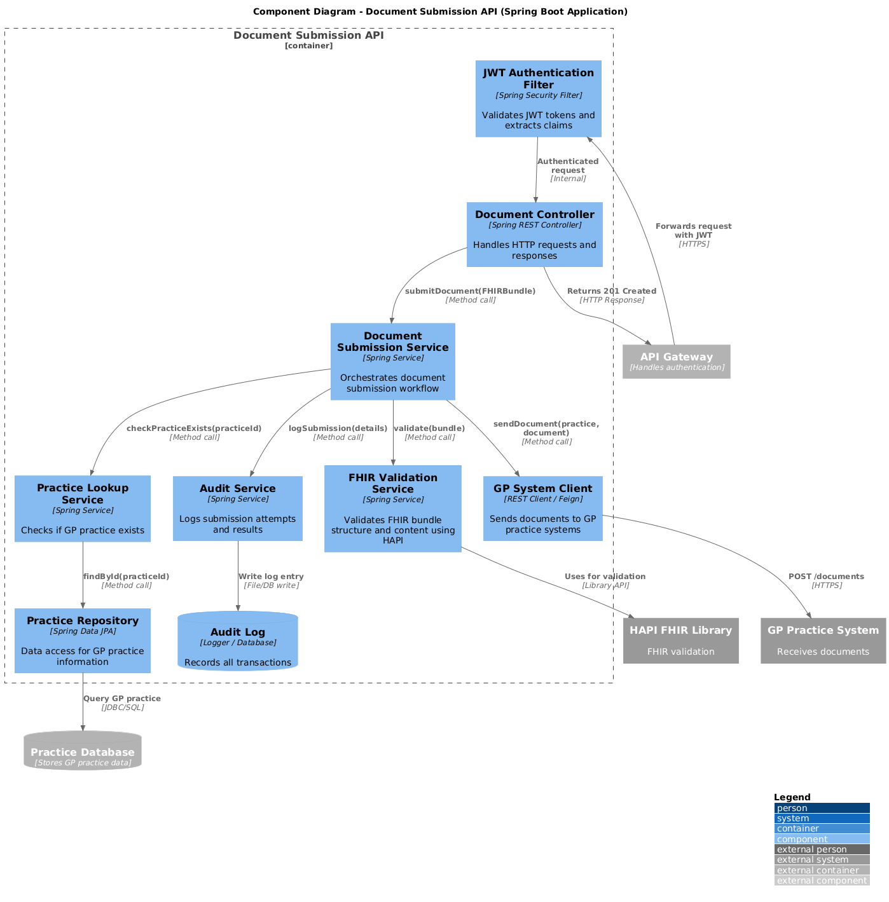
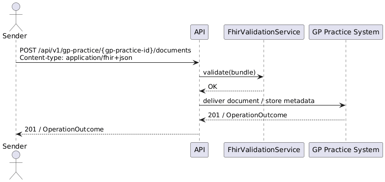
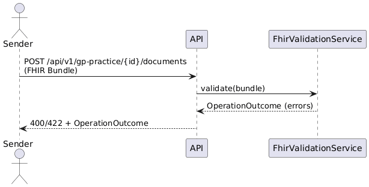

# Architecture Design Overview: GP Practice Document Submission API

## Document Details

**Document author**: Mark Evans

**Document version**: 1.0

**Status**: Draft

**Approved by**: ...

**Date approved**: ...

**Review date**: 2026/10/22

**Template version**: 1.2

### Revision History

| Date       | Version | Author   | Revision Summary |
| ---------- | :-----: | -------- | ---------------- |
| 2025-10-22 |  v1.0   |  Mark Evans | Initial draft |

## 1. Introduction and Goals

This document describes the architecture for the GP Practice Document Submission API — a service that accepts FHIR R4 Bundles (type=transaction) containing clinical documents (DocumentReference + Binary + Patient + Encounter + Practitioner + Organisation) and delivers them to GP practice systems.

### 1.1 Requirements Overview

- Accept FHIR R4 Bundles (transaction)
- Validate syntactic and semantic correctness of FHIR resources
- Ensure the associated Binary resource is stored reliably
- Authenticate and authorize senders (API Gateway)
- Provide clear OperationOutcome responses for success/failure

### 1.2 Quality Goals

- Security: Confidentiality, integrity and availability of PHI
- Performance: Typical bundle processing in <2s for validation path (non-blocking storage)
- Scalability: Horizontal scaling on stateless API containers
- Observability: Tracing, metrics and structured logging for each submission

### 1.3 Stakeholders

| Role/Name | Contact | Expectations |
| --------- | ------- | ------------ |
| GP Practices |  | Receive validated clinical documents reliably |
| Hospital EHRs | | Ability to submit discharge summaries |
| Platform Operators |  | Secure, observable and resilient service |

## 2. Architecture Constraints

- Must accept FHIR R4 (JSON) Bundles as input.
- Must run in a typical cloud environment (managed Kubernetes or PaaS).
- Must store binary clinical documents in an object store (S3-compatible).
- Must integrate with existing identity provider (jwt).

## 3. Context and Scope

The system boundary is the GP Practice Document Submission API. It receives FHIR Bundles from external senders (Hospital systems), validates them, persists metadata, stores binary files in object storage, and forwards or makes available the clinical documents to the GP Practice System.

### 3.1 Business Context

- Replace ad-hoc file transfer with a validated, auditable API for clinical document submission.
- Provide consistent OperationOutcome responses aligned with NHS FHIR practices.

### 3.2 Technical Context

- External senders: Hospital EHRs, middleware
- API Gateway: TLS termination, authentication, rate-limiting
- GP Docs API: ASP.NET Core Web API application (controller + services)
- Backend: SQL Server for metadata, MinIO object store for Binary resources


## 4. Solution Strategy

- Use a layered ASP.NET Core application with Controller -> Service -> Repository pattern.
- Use Firely .NET SDK (Hl7.Fhir.R4) for parsing and validating FHIR R4 resources.
- Keep API stateless so it can scale horizontally; persist state to SQL Server and object store.
- Push logs and metrics to central observability stack (Prometheus/Grafana + ELK)

## 4.1 Technology Stack

This application has been built using modern .NET technologies:

- **.NET 8**: Latest LTS version of .NET with improved performance and features
- **ASP.NET Core Web API**: High-performance RESTful API framework
- **Entity Framework Core 8**: Modern ORM for SQL Server database access
- **Firely .NET SDK (Hl7.Fhir.R4)**: Official .NET FHIR library for R4 support and validation
- **Serilog**: Structured logging framework
- **Minio .NET Client**: S3-compatible object storage client
- **RabbitMQ.Client**: Direct RabbitMQ integration for message queuing

## 4.2 Building and Running

### Prerequisites

- .NET 8 SDK or later
- SQL Server (2019+)
- MinIO (object storage)
- RabbitMQ (message broker)
- ClamAV (virus scanning service)

### Build the Application

```bash
cd src
dotnet restore
dotnet build
```

### Run Locally

```bash
cd src
dotnet run
```

The API will be available at `http://localhost:8080`

### Build Docker Image

```bash
docker build -t gp-practice-documents:4.1.0 .
```

### Run with Docker

```bash
docker run -p 8080:8080 \
  -e ConnectionStrings__DefaultConnection="Server=sqlserver;Database=gp_practices;User Id=sa;Password=YourPassword;" \
  gp-practice-documents:4.1.0
```

## 4.3 Configuration

Configuration is managed through `appsettings.json`. Key settings include:

- **ConnectionStrings:DefaultConnection**: SQL Server connection string
- **DocumentProcessing:Mode**: Processing mode (SYNC, ASYNC, or HYBRID)
- **ClamAV**: Virus scanning service configuration
- **MinIO**: Object storage configuration
- **RabbitMQ**: Message broker configuration

See `src/appsettings.json` for full configuration options.

## 4.4 API Endpoints

### Submit Document Bundle

```http
POST /api/v1/gp-practice/{gpPracticeId}/documents
Content-Type: application/fhir+json
```

**Request Body**: FHIR R4 Bundle (transaction type) containing:
- DocumentReference
- Binary (clinical document)
- Patient (with verified NHS Number)
- Encounter
- Practitioner
- Organization

**Response**: FHIR OperationOutcome with success/error details

## 5. Building Block View

### 5.1 C4 Level 1 View



### 5.2 C4 Level 2 View



### 5.3 C4 Level 3 View



## 6. Runtime View

Important runtime scenarios are captured as sequence diagrams below.

### Sequence: Submit Document Bundle



### Sequence: Error Handling (invalid bundle)



## 7. Deployment view

Generic cloud deployment:

- API Gateway (managed) — TLS termination and OAuth2/OIDC authentication.
- Kubernetes cluster (or container service) running stateless GP Docs API pods (.NET 8) behind an autoscaling group.
- SQL Server (managed) for metadata and audit records.
- MinIO/S3 object storage for Binary resources.
- RabbitMQ message broker for async delivery to GP systems.
- Observability stack: Prometheus, Grafana, ELK/Cloud Logging with Serilog integration.

## 8. Crosscutting Concepts

### 8.1 Design Patterns

- Layered architecture (Controller -> Service -> Repository)
- Validation-as-a-service (FhirValidationService)

### 8.2 Security

- Transport: TLS 1.2+ enforced at API Gateway.
- Authentication/Authorization: OAuth2/OIDC; clients obtain tokens; scopes limit access.
- Input validation: strict FHIR validation and size limits for Binary resources.
- Data protection: store PHI encrypted at rest (DB and object store) and encrypted in transit.
- Audit: immutable audit trail for submissions (write-ahead logs/audit table).
- Secrets: use cloud secret manager for DB credentials and encryption keys.

### 8.3 Scalability

- Stateless API nodes behind load balancer enable horizontal scaling.
- SQL Server scaled vertically or via read replicas for read-heavy workloads.
- MinIO object store offloads large binary sizes and scales independently.
- .NET 8 runtime provides excellent performance and memory efficiency for containerized workloads.

### 8.4 Resilience

- Retries with exponential backoff for transient errors (e.g., storage timeouts).
- Circuit breakers on downstream calls if integrated with external GP endpoints.
- Dead-letter queue for failed async deliveries.

### 8.5 Observability

- Structured logging (JSON) with correlation IDs per submission.
- Metrics: request rate, validation success/failure, processing latency.
- Tracing (W3C TraceContext) to follow submission across services.

### 8.6 Regulatory & Compliance

- Treat submitted data as sensitive health data; follow regional regulations (e.g., UK Data Protection Act / GDPR).
- Data retention policies for audit logs and binaries must be defined.

## 9. Architecture Decisions

- Use Firely .NET SDK for FHIR R4 validation and parsing.
- Implement using ASP.NET Core 8 for modern, cross-platform deployment.
- Keep API stateless; use cloud-managed DB and object storage.
- Use Entity Framework Core for database access with SQL Server.

### 9.1 ADRs

| ID | Impact | Decision |
| -- | ------ | -------- |
| ADR-001 | High | Migrated from Java/Spring Boot to C#/.NET 8 for improved performance and modern tooling |
| ADR-002 | High | Use Firely .NET SDK (Hl7.Fhir.R4) for FHIR validation and resource handling |
| ADR-003 | Medium | Use Serilog for structured logging instead of traditional logging frameworks |

## 10. Quality Requirements

- Availability: 99.9% SLA for core submission paths.
- Latency: median validation latency < 2s.
- Throughput: scale to handle bursts of submissions from multiple hospital sources.

## 11. Risks and Technical Debt

### 11.1 Risks

| ID | Impact | Mitigation / Plan | Owner |
| -- | ------ | ----------------- | ----- |
| R-001 | High | Sensitive PHI exposure if TLS/auth misconfigured | Platform Ops |
| R-002 | Medium | Malformed FHIR bundles cause processing errors | Improve validation & clearer OperationOutcome messages |

### 11.2 Technical Debt

| ID | Impact | Mitigation / Plan | Owner |
| -- | ------ | ----------------- | ----- |
| TD-001 | Medium | No async delivery pipeline implemented | Introduce message broker for retries and durability |

## 12. Glossary

| Term | Definition |
| ---- | ---------- |
| FHIR | Fast Healthcare Interoperability Resources (R4) |
| Bundle | FHIR Bundle resource (transaction) |
| DocumentReference | FHIR resource pointing to clinical document |
| Binary | FHIR resource containing binary payload (PDF) |

